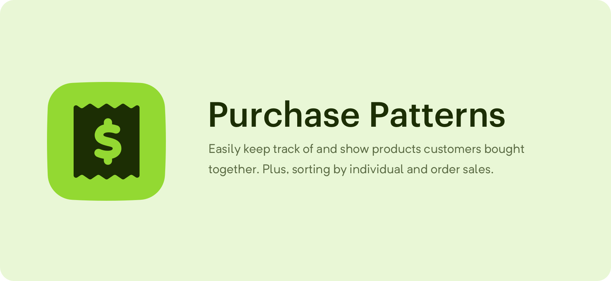

# Purchase Patterns
Easily keep track of and show products customers bought together. Plus, sorting 
by individual and order sales.

## Requirements

This plugin requires Craft CMS 3.0.0 or later, and Craft Commerce 2.0.0-beta.2 
or later.

## Installation

Purchasable via the Plugin Store.

## Usage

Use the `craft.purchasePatterns.related` function in your templates to get 
related products that customers also bought.

```php
ProductQueryExtended related ( Product|Order $target [, int $limit = 8 [, ProductQuery $paddingQuery = null [, array $filter = [] ] ] ] )
```

The function returns a `ProductQueryExtended`, so you can include additional 
query parameters as needed. The `id` parameter is already set and shouldn't be 
overridden.

```twig

```

Setting `fixedOrder` to true will sort the products by times purchased together.

The `paddingQuery` allows you to specify a `ProductQuery` that will be used to 
pad out the related results if they fall below the given `limit`. This query 
should NOT include things like `order`, `limit`, or execution commands like 
`all`.

```twig

```

**Editor's Note:** `random()` is Postgres specific. Use `RAND()` for MySQL.

`filter` expects an array of properties that will be used to filter the final 
result. You can use this to ensure your query always returns the expected number 
of results. You can pass any properties that you would otherwise include in the 
outer query:

```twig

``` 

For more info on the filter feature (added by [jmauzyk](https://github.com/jmauzyk)) 
see [#3](https://github.com/ethercreative/purchase-patterns/pull/3).

### Extended Product Query

The extended product query allows you to sort the products by `qtyCount` and 
`orderCount`. It extends the base product query, to you can use it the same way 
as you would `craft.products`. The `related` query above returns an extended 
query, as does:

```twig

``` 