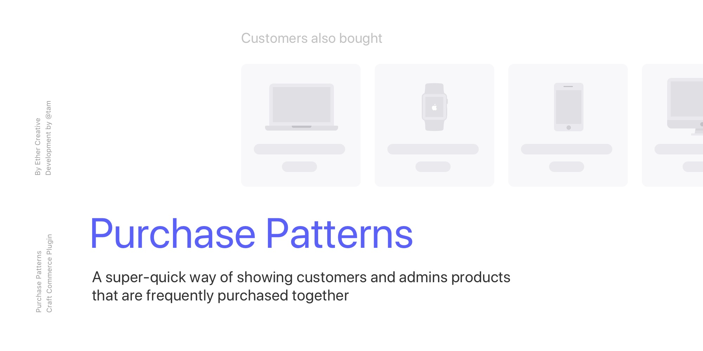

# Purchase Patterns
Easily keep track of products customers bought together — for Craft Commerce 2

## Requirements

This plugin requires Craft CMS 3.0.0 or later, and Craft Commerce 2.0.0-beta.2 or later.

## Installation

Purchasable via the Plugin Store.

## Usage

Use the `craft.purchasePatterns.related` function in your templates to get related products that customers also bought.

```php
ProductQuery related ( Product|Order $target [, int $limit = 8 [, ProductQuery $paddingQuery = null ] ] )
```

The function returns a `ProductQuery`, so you can include additional query parameters as needed. The `id` parameter is already set and shouldn't be overridden.

```twig

```

Setting `fixedOrder` to true will sort the products by times purchased together.

The `paddingQuery` allows you to specify a `ProductQuery` that will be used to pad out the related results if they fall below the given `limit`. This query should NOT include things like `order`, `limit`, or execution commands like `all`.

```twig

```

**Editor's Note:** `random()` is Postgres specific. Use `RAND()` for MySQL.